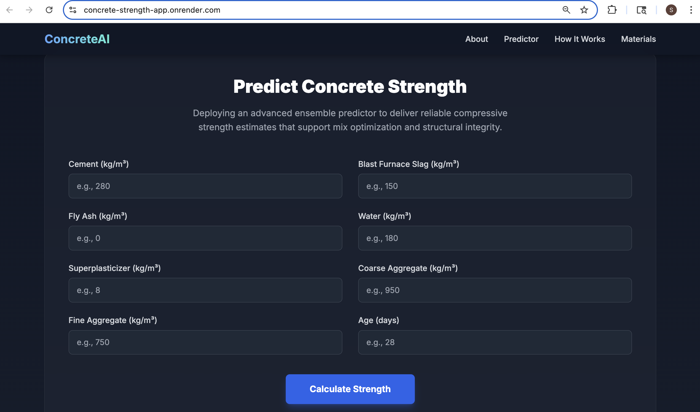

## Meta-Learning-Based Concrete Strength Predictor

**Live Demo:** https://concrete-strength-app.onrender/personal.com
    
**Note:** This application is hosted on a free service and may take up to 60 seconds to load for the first time as the server "wakes up." If you see an error, please wait a moment and refresh the page.




An advanced machine learning application featuring a hierarchical CatBoost ensemble and a non-linear meta-learner to deliver high-precision predictions of concrete compressive strength. This project is based on the research paper, "Meta-Learning-Based Concrete Strength Prediction Using Stratified CatBoost Models and Domain-Informed Features."

## Overview

Concrete Compressive Strength is the most critical performance metric of concrete, representing its capacity to withstand compressive loads without failure. Traditionally, determining this strength requires casting physical cylinders and waiting up to 28 days for them to cure before they can be lab-tested. This delay introduces significant uncertainty and bottlenecks into construction timelines.

This project introduces a comprehensive ensemble framework to overcome that challenge. By predicting compressive strength based on the initial mix design and age, this tool empowers civil engineers, project managers, and material scientists to make rapid, data-driven decisions. It allows for the virtual testing of countless mix variations to optimize for cost, sustainability, and performance, leading to safer and more economical construction projects.

## Key Features:

**High-Performance Ensemble Model:** Achieves an R² of 0.977 and an RMSE of 2.61 MPa on the test set.

**Domain-Informed Feature Engineering:** Generates 24 derived features grounded in materials science to capture complex non-linear interactions and time-dependent behaviors.

**Strength-Range Stratification:** Employs specialized sub-models tailored to four predefined strength categories, augmented by boundary-region and age-specific predictors for enhanced accuracy.

**Interactive Web Interface:** A clean, professional, and fully responsive UI built with Flask and deployed on Render for public access.

## The AI Engine: Model Architecture

The prediction engine is a multi-stage hierarchical ensemble designed for high accuracy and robustness, based on the architecture detailed in the project report.

**Domain-Informed Feature Engineering:** The model first creates 24 new features from the 8 base inputs. These include critical engineering ratios (e.g., water-to-cementitious), cement chemistry features, time-dependent transformations (e.g., maturity index), and range-specific correction factors.

**Stratified Sub-Models (Ensemble Learning):** A team of specialized CatBoost models analyze the engineered features. A powerful base model is complemented by "expert" models, each trained for a specific scenario:

**Range-Specific Models:** For Very Low (<20 MPa), Low (20-40 MPa), Medium (40-60 MPa), and High (>60 MPa) strength concrete.

**Boundary Models:** To handle the transition zones between strength ranges.

**Age-Specific Models:** To better capture concrete maturity.

**Non-Linear Meta-Learner:** A final CatBoost-based meta-learner intelligently integrates the predictions from all sub-models. It adaptively weighs their outputs based on the input features to form a single, highly accurate, and reliable final prediction.

## Results & Performance

The model was validated on a test set of 206 samples, demonstrating significant improvements over baseline models, particularly in the challenging very-low and high-strength ranges.

**Metric Performance:**

R² Score: 0.977

RMSE: 2.61 MPa

MAE: 1.47 MPa

Predictions within 10% Error: 88.4%

Predictions within 5% Error: 69.4%

## Technical Stack
Backend: Python 3.11, Flask, Gunicorn

Machine Learning: CatBoost (v1.2.5), Scikit-learn (v1.5.0), Pandas (v2.2.2), NumPy (v2.0.2)

Frontend: HTML, Tailwind CSS, JavaScript

Deployment: Render, Git

## Setup and Installation

To run this project locally, you will need Python 3.11 and a virtual environment tool like conda or venv.

1. Clone the Repository

git clone [https://github.com/vidyacheekuri/concrete-strength-prediction.git]
cd concrete-strength-prediction

2. Create and Activate a Virtual Environment
Using conda:

conda create --name concrete_env python=3.11
conda activate concrete_env

Or using venv:

python3 -m venv venv
source venv/bin/activate

3. Install Dependencies
The requirements.txt file contains all the necessary libraries with compatible versions.

pip install -r requirements.txt

4. Run the Application
The Flask development server will start, and you can access the application in your browser.

python app.py


## Project Structure

```
.
├── models/
│   └── enhanced_catboost_model.joblib  # The trained and saved model file
├── templates/
│   └── index.html                      # The HTML file for the user interface
├── app.py                              # The main Flask application script
├── train.py                            # The script for training the model
├── catboost.ipynb                      # The original Jupyter Notebook for experimentation
├── requirements.txt                    # A list of all Python dependencies
├── Concrete_Data.xls                   # The raw training data
└── README.md                           # This file
```

**LinkedIn**: linkedin.com/in/sreevidyacheekuri
